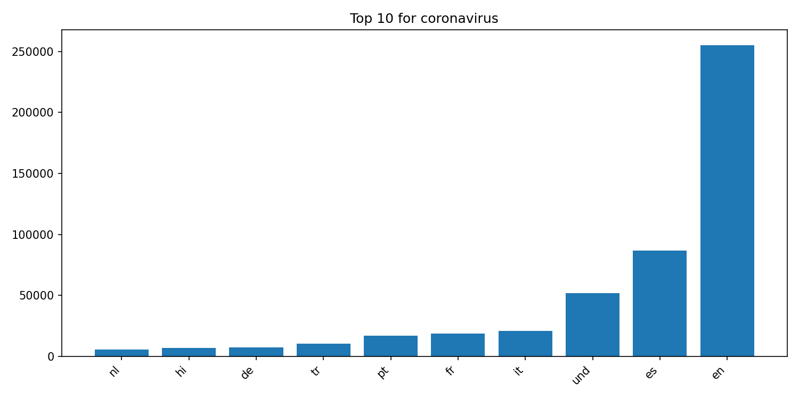
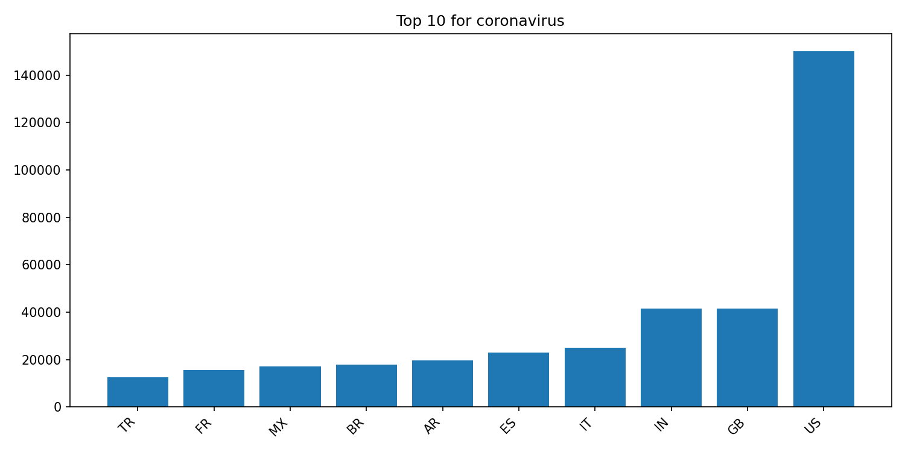
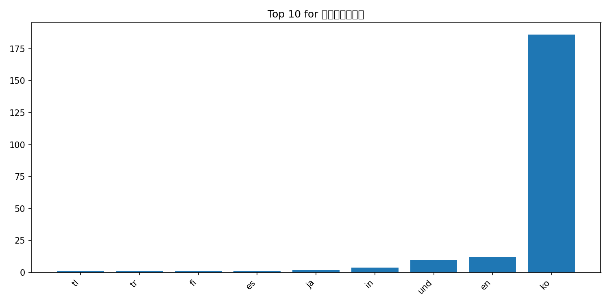
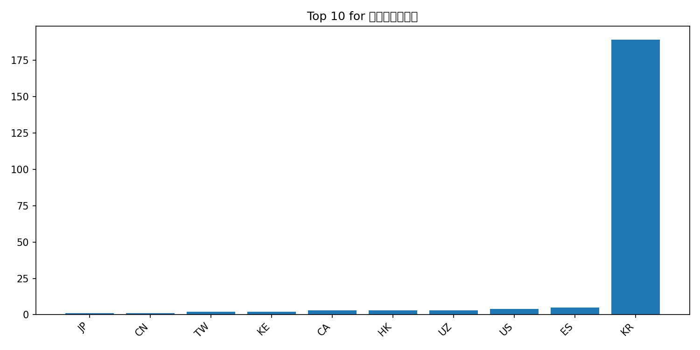
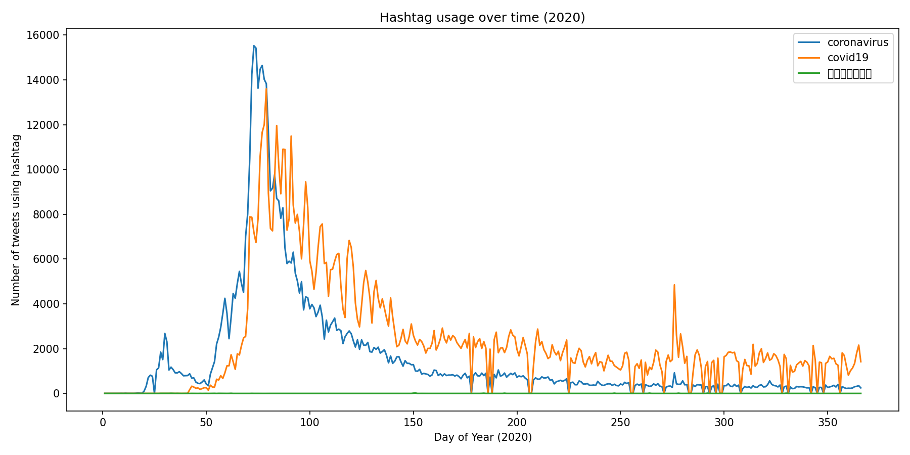

# Coronavirus twitter analysis (2020)

## Project Overview

This project analyzes approximately 1.1 billion geotagged tweets from 2020 to study how coronavirus-related hashtags spread across languages and countries. Using a MapReduce-based parallel processing pipeline, I built a scalable system capable of handling large-scale multilingual social media data.

The dataset consists of daily compressed tweet archives. Each tweet was parsed, filtered for specific hashtags, and then aggregated at both the language and country levels.

---

## MapReduce Architecture

**Map Phase**
- Parsed daily compressed tweet archives
- Extracted hashtag occurrences
- Counted usage by language and country
- Output intermediate daily results

**Reduce Phase**
- Combined daily outputs into yearly aggregates
- Produced global counts by language and country

**Visualization Phase**
- Generated top-10 bar charts
- Created time-series plots showing hashtag trends throughout 2020

---

## Results - Top 10 Hashtag Usage

### Coronavirus by Language

### Coronavirus by Country

### 코로나바이러스 by Language

### 코로나바이러스 by Country

---

## Time Series Analysis (2020)

The following plot shows daily hashtag usage throughout 2020.

